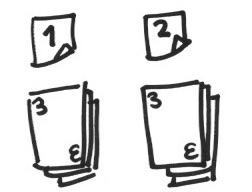
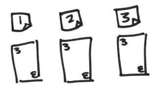
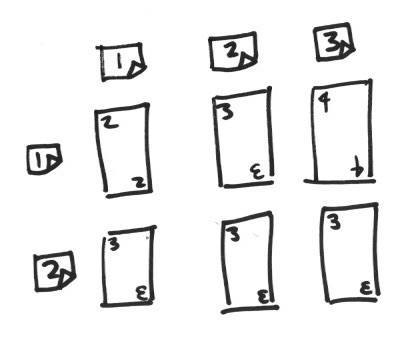

# Oh, Snap!

This is an exercise in logical thinking that uses some of the ideas that you learned in the [Codecademy JavaScript courses](https://www.codecademy.com/learn/javascript).

You'll need:

* a pack of cards;
* some pens, paper, and sticky notes.

## Snap Attack

Mark two slots using sticky notes. Take cards from the deck and place them in slot 1, then slot 2, and so on.

Stop placing cards once you have a matching pair (Snap!).

### Coding without coding

Now grab the pen and paper. Write down instructions for how to play this game.

Think about how to tell the player when to keep going and when to stop.

## You've Got The Power

Add a third slot. Pick up all the cards, and shuffle them. Now play the game again.

### Coding without coding

Now update your instructions to allow for slot 3.

## It's gettin' kinda hectic

Now add another row: you should six slots in total.

Stop when you have a match in a row, or a match in a column.

### Coding without coding

Now update your instructions to take account of the new row.

Then relax by [watching a really old video](https://www.youtube.com/watch?v=_BRv9wGf5pk).
